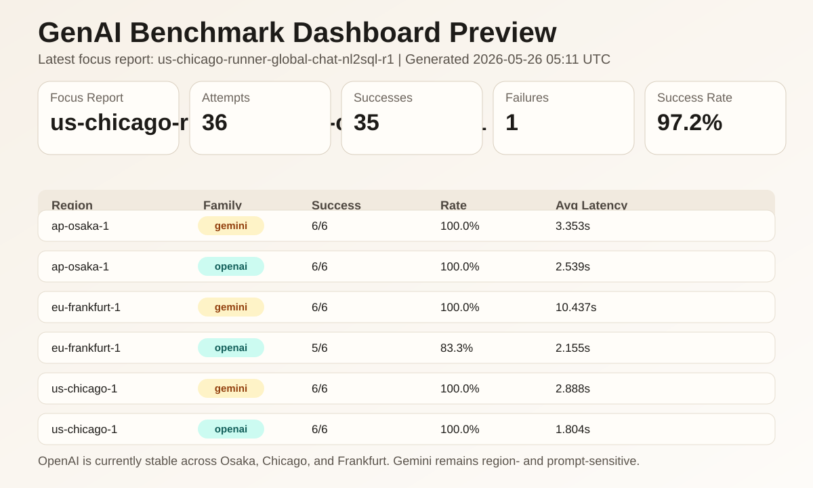

# GenAI Benchmark

OCI Generative AI OpenAI-compatible endpoint를 대상으로 프롬프트 세트를 반복 실행하고,
모델별 지연시간, 토큰 사용량, 성공률을 비교하는 Python CLI 프로젝트입니다.

기본 실행 대상은 `OpenAI`와 `Gemini`이며, `Grok`과 `Meta`는 명시적으로 선택해서 테스트할 수 있습니다.
현재 리포트는 평균/p95/p99 latency, end-to-end output tokens/sec, 선택적 streaming TTFT, 실패 응답 상세정보를 함께 기록합니다.

## Dashboard Preview

[](docs/dashboard.html)

- 정적 대시보드: [docs/dashboard.html](docs/dashboard.html)
- GitHub Pages 루트용 엔트리: [docs/index.html](docs/index.html)

## Latest Findings

현재 대표 기준 리포트는 `cross-region-baseline-r3` 입니다.

### Cross-Region Baseline (`repeats=3`)

| Region | Family | Success | Avg Latency |
| --- | --- | --- | --- |
| `ap-osaka-1` | `openai` | `9/9` | `1.171s` |
| `ap-osaka-1` | `gemini` | `6/9` | `3.121s` |
| `eu-frankfurt-1` | `openai` | `9/9` | `1.704s` |
| `eu-frankfurt-1` | `gemini` | `3/9` | `1.754s` |
| `us-chicago-1` | `openai` | `9/9` | `1.642s` |
| `us-chicago-1` | `gemini` | `9/9` | `3.758s` |

핵심 관찰:

- `openai.gpt-oss-20b`는 Osaka, Chicago, Frankfurt에서 모두 안정적으로 성공했습니다.
- `google.gemini-2.5-flash`는 Chicago에서는 안정적이었지만, Osaka와 Frankfurt에서는 특정 프롬프트에서 `Internal Server Error`가 반복 재현됐습니다.
- 현재 측정에서는 `openai.gpt-oss-20b`가 더 빠르고 일관적입니다.

참고 리포트:

- [runs/cross-region-baseline-r3.md](runs/cross-region-baseline-r3.md)
- [runs/cross-region-smoke-r1.md](runs/cross-region-smoke-r1.md)
- [runs/baseline-osaka-r3.md](runs/baseline-osaka-r3.md)

## What This Repo Includes

```text
genai-benchmark/
├── benchmark.py
├── genai_benchmark/
│   ├── cli.py
│   ├── catalog.py
│   ├── dashboard.py
│   ├── reporting.py
│   ├── runner.py
│   └── site.py
├── docs/
│   ├── dashboard.html
│   ├── dashboard-preview.svg
│   └── index.html
├── prompts/
│   ├── sample_prompts.jsonl
│   └── debug_*.jsonl
├── runs/
├── scripts/
│   └── publish_site.sh
├── .env.example
├── PLAN.md
└── requirements.txt
```

## Setup

```bash
cd /home/opc/genai-benchmark
python3.11 -m venv .venv
source .venv/bin/activate
pip install -U pip
pip install -r requirements.txt
cp .env.example .env
```

이 환경의 기본 `python3`는 `3.6.8`이라 사용할 수 없습니다. 항상 `python3.11` 기반 가상환경을 쓰세요.

`.env` 예시:

```bash
OCI_PROFILE=DEFAULT
OCI_COMPARTMENT_ID=<your_compartment_ocid>
OCI_APP_REGION_LABEL=seoul-client
OCI_GENAI_REGION=ap-osaka-1
```

필수 입력:

| 변수 | 필수 | 의미 |
| --- | --- | --- |
| `OCI_PROFILE` | 선택 | `~/.oci/config` 프로파일 이름 |
| `OCI_COMPARTMENT_ID` | 필수 | OCI Generative AI 호출용 컴파트먼트 OCID |
| `OCI_APP_REGION_LABEL` | 선택 | benchmark를 실행하는 노드 위치 라벨 |
| `OCI_GENAI_REGION` | 선택 | 기본 대상 리전 |

## Model Selection Rules

- 기본 실행은 `openai`와 `gemini` family만 포함합니다.
- `grok`, `meta`는 기본 실행에 포함되지 않습니다.
- `grok`, `meta`를 돌릴 때는 `--family`와 `--include-experimental`를 함께 주는 방식을 권장합니다.
- 특정 모델 하나만 강제로 돌리려면 `--model`을 직접 지정합니다.
- 리전 미지원 조합은 실행 전에 자동으로 제외되고, `--dry-run`과 결과 리포트에 사유가 기록됩니다.

## Common Commands

지원 family 확인:

```bash
source .venv/bin/activate
python benchmark.py --list-families
```

지원 모델 확인:

```bash
python benchmark.py --list-models
```

구성만 검증:

```bash
python benchmark.py --dry-run
```

Osaka baseline:

```bash
python benchmark.py \
  --region ap-osaka-1 \
  --repeats 3 \
  --report-name baseline-osaka-r3
```

Cross-region smoke:

```bash
python benchmark.py \
  --region ap-osaka-1 \
  --region us-chicago-1 \
  --region eu-frankfurt-1 \
  --repeats 1 \
  --report-name cross-region-smoke-r1
```

Cross-region baseline:

```bash
python benchmark.py \
  --region ap-osaka-1 \
  --region us-chicago-1 \
  --region eu-frankfurt-1 \
  --repeats 3 \
  --report-name cross-region-baseline-r3
```

Concurrency ramp:

```bash
python benchmark.py \
  --region ap-osaka-1 \
  --repeats 3 \
  --concurrency-levels 1,5,10 \
  --report-name osaka-ramp-c1-c5-c10
```

Streaming TTFT 측정:

```bash
python benchmark.py \
  --region ap-osaka-1 \
  --repeats 3 \
  --streaming \
  --report-name osaka-streaming-ttft
```

실험용 family 실행:

```bash
python benchmark.py \
  --family meta \
  --include-experimental \
  --region ap-osaka-1 \
  --repeats 3 \
  --report-name meta-osaka
```

## Reports And Dashboard

벤치마크 실행 시 아래 산출물이 생성됩니다.

- `runs/<report-name>.json`
- `runs/<report-name>.md`

리포트 summary는 아래 지표를 포함합니다.

| Metric | Meaning |
| --- | --- |
| `schema_version` | JSON report schema version |
| `benchmark_config` | 실행 당시 prompt, region, repeats, concurrency, streaming 설정 |
| `avg_latency_seconds` | 성공 요청의 평균 end-to-end latency |
| `p95_latency_seconds` | 성공 요청 latency의 p95 |
| `p99_latency_seconds` | 성공 요청 latency의 p99 |
| `avg_ttft_seconds` | `--streaming` 실행 시 첫 non-empty chunk까지 걸린 평균 시간 |
| `avg_total_tokens` | token usage가 있는 성공 요청의 평균 total tokens |
| `avg_output_tokens_per_second` | `output_tokens / end-to-end latency` 평균 |
| `avg_post_ttft_output_tokens_per_second` | `--streaming` 실행 시 `output_tokens / (latency - TTFT)` 평균 |

`avg_output_tokens_per_second`는 클라이언트가 체감한 전체 latency 기준 처리량입니다.
`avg_ttft_seconds`와 `avg_post_ttft_output_tokens_per_second`는 `--streaming`을 켠 실행에서만 기록됩니다.

### JSON Schema Notes

현재 JSON 리포트 schema version은 `2.0`입니다.

최상위 구조:

- `schema_version`: 리포트 형식 버전
- `generated_at`: 리포트 생성 UTC timestamp
- `benchmark_config`: 실행 당시 prompt, region, repeats, concurrency, streaming 설정
- `selected_models`: 실행 대상으로 선택된 catalog model 정보
- `summary`: region/model/case/concurrency 단위 집계
- `results`: 개별 요청 결과
- `skipped`: catalog 기준으로 제외된 region/model 조합

`summary`와 `results`의 streaming 관련 필드는 streaming 실행에서만 값이 채워지고,
기존 non-streaming 실행에서는 `null` 또는 `-`로 표시됩니다.

실패 요청은 아래 진단 필드를 가능한 범위에서 저장합니다.

- exception type/message
- HTTP status
- response body preview
- request id 후보 헤더 (`opc-request-id`, `x-request-id` 등)

대시보드는 현재 `runs/` 아래 모든 JSON 리포트를 종합해서 만듭니다.
HTML 안에서 리전, 모델, concurrency 필터와 case table 정렬을 바로 사용할 수 있습니다.

```bash
source .venv/bin/activate
python genai_benchmark/dashboard.py --output runs/dashboard.html
```

GitHub용 정적 사이트 산출물은 아래 명령으로 생성합니다.

```bash
./scripts/publish_site.sh
```

이 스크립트는 아래 파일을 갱신합니다.

- `docs/dashboard.html`
- `docs/index.html`
- `docs/dashboard-preview.svg`

README의 미리보기 이미지는 `docs/dashboard-preview.svg`를 직접 가리키므로,
GitHub에 올리면 별도 스크린샷 없이 최신 대시보드 미리보기가 보입니다.

## GitHub Deployment Notes

이 프로젝트는 `docs/` 기반 GitHub Pages 배포를 전제로 정리돼 있습니다.

권장 배포 흐름:

1. `./scripts/publish_site.sh`로 `docs/`를 갱신합니다.
2. 변경된 `README.md`, `docs/*`, 코드 파일을 커밋합니다.
3. GitHub에 push 합니다.
4. GitHub 저장소 설정에서 Pages를 `Deploy from a branch`로 켭니다.
5. 브랜치는 `main`, 폴더는 `/docs`를 선택합니다.

그러면 대시보드 루트는 대체로 아래 형태가 됩니다.

- `https://<your-github-username>.github.io/<repo-name>/`

## Current Known Issues

- `google.gemini-2.5-flash`는 일부 리전과 프롬프트 조합에서 `Internal Server Error`가 반복됩니다.
- 실패 요청은 토큰 사용량이 없을 수 있어 token/throughput 지표에서 제외됩니다.
- streaming TTFT는 provider/endpoint의 streaming 지원 여부에 따라 실패할 수 있습니다. 기본 non-streaming 실행은 기존 방식 그대로 유지됩니다.
- 샌드박스 내부에서는 OCI endpoint 네트워크 제약 때문에 실제 실행이 실패할 수 있습니다. 실벤치마크는 샌드박스 밖 실행이 필요할 수 있습니다.

## Next Useful Improvements

- 리전별/모델별 산점도와 failure marker 추가 개선
- GitHub Actions로 `docs/` 자동 갱신 또는 Pages 배포 자동화
